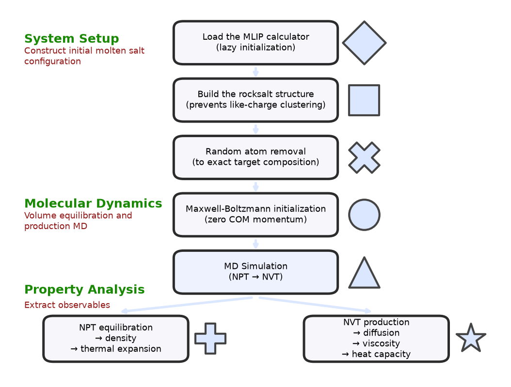

# MoltenSaltCalc

MoltenSaltCalc is a Python package for molecular dynamics simulations of molten salts using the Atomic Simulation Environment (ASE) and machine-learned interatomic potentials (MLIPs).

It provides a unified interface to multiple MLIP backends, enabling rapid setup and analysis of molten salt simulations.

---

## Features

- Molecular dynamics simulations built on ASE
- Unified interface for multiple MLIP backends (GRACE, FairChem, MACE, ...)
- Easy switching between pretrained models
- Tools for simulation analysis

---

## Installation

Install the package together with the desired MLIP backend, for example:

```bash
pip install moltensaltcalc[mace]
```

further options include:

```bash
pip install moltensaltcalc[7net]
pip install moltensaltcalc[alphanet]
pip install moltensaltcalc[chgnet]
pip install moltensaltcalc[deepmd]
pip install moltensaltcalc[eqnorm]
pip install moltensaltcalc[equiformer]
pip install moltensaltcalc[equiformer_v3]
pip install moltensaltcalc[fairchem]
pip install moltensaltcalc[grace]
pip install moltensaltcalc[hienet]
pip install moltensaltcalc[matgl]
pip install moltensaltcalc[matris]
pip install moltensaltcalc[mattersim]
pip install moltensaltcalc[nequip]
pip install moltensaltcalc[nequix]
pip install moltensaltcalc[orbitals]
pip install moltensaltcalc[tace]
pip install moltensaltcalc[upet]
```

Note: MLIP backends may have conflicting dependencies. It is recommended to use separate environments for each backend.

By default, the installation is shipped along with the `torch-dftd3` calculator for long-range interactions. If you do not wish to install/use the dispersion calculator, install with `-nodisp` instead, e.g.

```bash
pip install moltensaltcalc[mace-nodisp]
```

If you want to use the (slower but more accurate) `dftd4` calculator, install the `dftd4` variant, e.g.

```bash
pip install moltensaltcalc[mace-nodisp,dftd4]
```

---

## Quick start

```python
import numpy as np

from moltensaltcalc import MoltenSaltSimulator, MoltenSaltAnalyzer

np.random.seed(42)  # Ensure reproducibility (initial random placements)

sim = MoltenSaltSimulator(
    model_name="mace",  # Use the MACE model
    model_parameters={
        "model_size": "small",  # Use the MACE-MP-0a small model
        "model_task": "Default"
    },
    dispersion=None  # Disable dispersion
)
atoms = sim.build_system(
    salt_anion=["F", "Cl"],
    salt_cation=["Na"],
    n_anions=[10, 5],  # 10 F atoms and 5 Cl atoms
    n_cations=[15],  # 15 Na atoms
    density_guess=2.0,  # g/cm³
)
sim.run_npt_simulation(
    atoms,
    T=1100,  # K
    steps=1000,  # MD steps
    timestep_fs=1.0,  # fs
    traj_file="npt_simulation.traj",  # Trajectory file
)

analyzer = MoltenSaltAnalyzer(
    traj_files_npt=["npt_simulation.traj"],  # Trajectory file(s)
    temperatures_npt=[1100],  # K
)
density = analyzer.compute_eq_density(T=1100)  # 1.68 g/cm³
C = analyzer.compute_heat_capacity(T=1100, eq_fraction=0.2)  # 0.07 J/g/K
```

---


## Workflow

The workflow of the MoltenSaltCalc aims to provide an optimized environment for molecular dynamics (MD) simulations of molten salts. A typical simulation starts by loading the MLIP backend, done in a lazy manner so the package could also be used without it (e.g. only for analysis or system setup). Next, the system is built starting out from the rocksalt structure, which is different from the usually applied random placements (which can still be used by setting the parameter `lattice` in `build_system` to `"random"`) in order to ensure the absence of clusters of ions with the same charge which typically lead to an initial volume expansion thus requiring a longer volume equilibration simulation. Since the rocksalt contains two atoms per unit cell, but we want to allow an arbitrary number of anions and cations, some random positions are removed from the larger lattice to match the desired composition. The volume of the resulting system is adjusted to match the desired density guess (input variable `density_guess` in g/cm<sup>3</sup>).

Before starting the MD simulation, the velocities are initialized with a Maxwell-Boltzmann distribution according to the desired temperature, while keeping the center of mass and the overall rotation fixed to ensure the temperature is not under-shot because the whole system is moving. Starting out from this, first an NPT (constant particles, pressure, temperature) simulation is run to equilibrate the system volume and obtain the density and thermal expansion of the molten salt (`MoltenSaltAnalyzer`). Then an NVT (constant particles, volume, temperature) simulation is run to obtain more properties such as diffusion, viscosity or heat capacity of the molten salt (`MoltenSaltAnalyzer`). The workflow is illustrated below:



---

## Examples

See example notebooks in the repository:

- [Simulator demo](https://github.com/leiapple/MoltenSaltCalc/blob/main/demo/simulator.ipynb)
- [Analyzer demo](https://github.com/leiapple/MoltenSaltCalc/blob/main/demo/analyzer.ipynb)

## Documentation

Use the navigation bar to explore:

- **API references**
    - [Analyzer API](Analyzer_API.md)
    - [Simulator API](Simulator_API.md)
    - [Model Error API](Model_Errors_AIP.md)
- [Available models](MLIPs.md)

## Repository

The source code is available on [GitHub](https://github.com/leiapple/MoltenSaltCalc).
